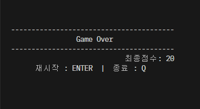

# 깃허브 주소
https://github.com/Vaundmayo/Nuguri.git

# 너구리 게임 실행 보고서

## 1. 프로젝트 개요
### 1.1 개발 목적
본 프로젝트는 제공된 초기 소스(nuguri.c)를 기반으로 콘솔 게임을 완성된 형태로 구현하고,
운영체제별 입출력/시스템 호출 차이를 처리할 수 있는 크로스 플랫폼 프로그래밍 능력을 기를 수 있다.

핵심 목표 :
- windows / Linux / macOS 환경에서 동일하게 동작하는 이식성 높은 게임 구현
- 전처리기(#ifdef)를 이용한 OS별 기능 분리 설계
- 맵 데이터 기반의 충돌 감지 및 게임 루프 처리 로직 강화
- 생명력, 스테이지, 타이틀, 엔딩 등 게임 플레이 요소 확장
- GitHub를 활용한 버전 관리 및 협업 경험 습득

이를 통해 단순한 콘솔 출력 수준을 넘어, 구조적 설계·알고리즘 처리·터미널 제어 등
실제 시스템 프로그래밍에 가까운 프로젝트 경험을 목표로 하였다.

---

### 1.2 개발 환경
| 구분 | 내용 |
|------|------|
| 사용 언어 | C 언어 |
| 개발 환경 | Windows 10 / Ubuntu 22.04 / macOS |
| IDE 및 도구 | Visual Studio Code + GitHub |
| 컴파일러 | MinGW, GCC, Clang |
| 주요 라이브러리 | stdio.h, stdlib.h, string.h, time.h, termios.h, unistd.h 등 |
| 실행 방식 | 텍스트 기반 콘솔 게임 (터미널 실행) |
| 버전 관리 | Git / GitHub (기능 단위 커밋 기록) |

---

### 1.3 팀 구성원 및 역할
| 학번 | 이름 | 역할 |
|------|------|------|
| 20223132 | 임민수 | 팀장 / 타이틀 및 엔딩 화면 / 동적 맵 할당 |
| 20233129 | 이세영 | 생명력 시스템 / 방향키 수정 |
| 20243104 | 박은서 | 크로스 플랫폼 / 사운드 효과 / 실행 보고서 |

* 버그 해결 방식 및 협업
  - 문제 발생 시 GitHub Issuses에 등록
  - 수정된 코드에 대해 팀원 전체가 크로스 테스트 후 승인
  -> 기능 개발은 역할 분담, 버그 해결은 전원 참여 방식으로 진행

---

## 2. 컴파일 및 실행 방법

###  Windows

```bash
gcc nuguri.c -o nuguri.exe
nuguri.exe
```

* 사운드는 Beep() API로 자동 출력된다.

###  Linux / macOS

```bash
make
./nuguri
```

* 사운드는 Linux('\a'), macOS(afplay) 적용
* vscode에서 WSL을 사용할 경우 아래 설정이 꺼져 있으면 소리가 들리지 않을 수 있다.
  - 설정 경로: Ctrl + , -> 검색창에 "terminal bell" 입력 -> sound = on

###  실행 시 유의사항

* 콘솔 창 크기를 너무 작게 하면 게임 화면이 잘려 보일 수 있다.
  -> 실행 후 창을 충분히 넓혀서 플레이해야한다.
* 'map.txt' 파일이 실행 파일과 같은 경로에 있어야한다.
  -> map.txt가 없으면 게임이 시작되지 않는다.

---
## 3. 구현 기능 리스트

### 3.1 타이틀 / 엔딩 / 게임오버 화면
| 기능 | 내용 |
|------|------|
| 타이틀 화면 | 맵 크기·스테이지 수·조작법 안내 표시 후 ENTER로 시작 / Q로 종료 가능 |
| 엔딩 화면 | 모든 스테이지 클리어 후 축하 메세지 및 최종 점수 출력 |
| 게임오버 화면 | 생명력 0일 때 출력되며, 재시작(ENTER) / 종료(Q) 선택 가능 |


### 3.2 생명 / 스테이지 / 점수 시스템
| 기능 | 내용 |
|------|------|
| 생명(Life) | 3개의 생명 제공, 적과 충돌시 감소. 화면에 ❤ 아이콘으로 표시 |
| 스테이지 진행 | 목표 지점 E 도달 시 다음 스테이지로 이동, 마지막 스테이지 클리어 시 엔딩 화면 |
| 점수 시스템 | 코인 휙득 시 +20점 / 스테이지 클리어 시 +100점. 결과 화면에 최종 점수 표시 |


### 3.3 크로스 플랫폼 호환
| 기능 | 내용 |
|--------|------|
| 입력 처리 | windows: getch/kbhit, Linux/macOS: Raw 모드 + 비동기 입력. |
| 화면 처리 | windows: cls + SetConsoleCursorPosition , Linux/macOS: ANSI 이스케이프 코드(`\033[2J\033[H`) 사용 |
| 딜레이 | windows: Sleep(ms), Linux/macOS: usleep(ms*1000) |
| 사운드 효과 | windows(Beep), macOS(afplay), Linux('\a') 지원 |
| 커서 제어 | 게임 중 커서 숨김 / 종료 시 다시 표시 |


### 3.4 맵 로딩 및 데이터 구조
| 기능 | 내용 |
|------|------|
| 맵 파일 로딩 | map.txt 파일을 읽어 스테이지별 맵을 메모리에 로드 |
| 오브젝트 등록 | S(플레이어), X(적), C(코인) 위치를 구조체 배열에 저장하여 좌표 기반 관리 |
| 동적 메모리 | 파일 크기에 맞춰 3차원 배열을 동적 할당하여 다양한 맵 크기 지원 |
| 메모리 해제 | free_maps()로 종료 또는 재시작 시 메모리 누수 방지 |


### 3.5 플레이어 이동, 점프, 사다리, 낙하, 충돌 처리
| 기능 | 내용 |
|------|------|
| 좌우 이동 | a/d 입력 또는 방향키 입력으로 이동. 벽(#)이 아닐 때만 이동 |
| 점프·중력 | velocity 기반 점프/낙하. 칸 단위 이동하며 천장·바닥 충돌 처리 |
| 사다리(H) | H 위에서 w/s로 오르기/내리기 가능. 착지 및 벽 위 보정 처리 |
| 낙하 | 발판 또는 사다리가 없을 경우 자동 낙하. 맵 아래로 떨어지면 스테이지 초기화 |
| 충돌 | 적 충돌 시 생명 감소, 코인 충돌 시 점수 증가 |


### 3.6 적(Enemy) / 코인(Coin) / 스테이지 관리
| 기능 | 내용 |
|------|------|
| 적 이동 | 적이 좌우 순환 이동하며, 앞이 벽이거나 낭떠러지면 방향 전환 |
| 코인 획득 | 플레이어와 좌표가 겹치면 수집 처리(collected) 후 점수 +20 |
| 스테이지 전환 | 목표 지점 E 도달 시 stage++, 다음 스테이지 로드 |
| 리스폰 | 적과 충돌해 생명이 남아 있을 경우 해당 스테이지를 처음부터 다시 시작 |


### 3.7 화면 UI 표시
| 기능 | 내용 |
|------|------|
| HUB 표시 | 상단에 stage / score / life 표시. life는 ❤ 아이콘으로 시각적 표현 |
| 조작 안내 | ← → 이동, ↑ ↓ 사다리, space 점프, q 종료 등의 조작 안내 표시 |
| 오브젝트 표현 | 플레이어(P), 적(X), 코인(C), 사다리(H), 벽(#), 빈 공간(' ')로 일정한 규칙 유지 |
| 깜빡임 최소화 | display_map 버퍼를 사용해 전체 화면을 한번에 렌더링 |

---

## 4. 게임 스크린샷

### 4.1 타이틀 화면 (시작)
- 게임 시작시 나오는 화면


### 4.2 stage1
- 첫번째 맵 화면


### 4.3 stage2
- 두번째 맵 화면


### 4.4 점프 화면
- space 동작 시 점프


### 4.5 사디리 이동
- ↑ ↓ 방향키 동작 시 사다리 이동


### 4.6 코인 획득 -> 점수 증가
- 코인 획득 시 20점이 증가되고 코인이 사라짐


### 4.7 적과 충돌
- 적과 충돌하면 재시작 되고 life가 1개 감소


### 4.8 게임오버 화면
- 게임오버 화면이 뜨면서 재시작(ENTER) 혹은 종료(Q) 선택



### 4.9 클리어 화면 (엔딩)
- 게임 완료시 나오는 화면


---

## 5. 개발 중 발생한 OS 호환성 문제와 해결 과정

### 5.1 입력 처리 방식 차이
- 문제: Linux에서는 방향키가 정상적으로 입력되지만 windows에서는 방향키가 정상적으로 인식되지 않음
- 해결: #ifdef _WIN32 조건문을 사용하여 windows에서는 getch()/kbhit()로 처리하고, Linux/macOS에서는 termios + 비동기 입력 방식으로 분기하여 동일한 조작이 가능하도록 구현


### 5.2 화면 지우기 및 커서 이동 차이
- 문제: Linux에서는 화면 클리어가 잘 되지만, windows에서는 깜빡임이 심하게 발생
- 해결: windows에서는 'SetConsoleCursorPosition'을 사용하여 커서를 (0,0)으로 이동한 뒤 필요한 부분만 다시 그리도록 하고, Linux/macOS에서는 기존처럼 ANSI escape 코드('\033[2J\033[H')를 사용하여 부드러운 화면이 가능하도록 OS별 화면 처리 함수를 분리


### 5.3 딜레이 시간 차이로 인한 게임 속도 불일치
- 문제: windows에서는 정상 속도로 플레이되는데 Linux에서는 지나치게 빠르게 동작
- 해결: #ifdef로 분기하여 windows는 Sleep(ms), Linux/macOS는 usleep(ms*1000)로 변환하여 통일


### 5.4 사운드 재생 방식 차이
- 문제: windows에서는 Beep()로 정상 출력되지만 macOS/Linux에서는 소리가 재생되지 않음
- 해결: windows는 Beep(), macOS는 afplay 시스템 사운드(aiff), Linux는 터미널 벨음 \a + 딜레이로 대체하여 OS별 사운드 함수를 분기 구현


### 결과
위와 같은 OS 간 차이로 인해 처음에는 동일한 코드로 실행 시 windows, macOS/Linux에서 서로 다르게 동작 했지만,
전처리기 분기 및 OS별 전용함수 구현을 통해 window, macOS/Linux 모두에서 완전히 동일한 게임을 제공하는 크로스 플랫폼 구조를 완성함

---

## 6. 결론
이번 프로젝트를 통해 C언어의 구조적 설계, 상태 관리, 파일 입출력, 그리고 운영체제별 호환성 처리까지 종합적으로 학습할 수 있었다.
기존 코드를 분석하고 확장하는 과정에서 함수 단위의 관리 중요성과 코드 흐름을 명확히 이해하는 것이 중요한것을 체감하였다.
조별 협업을 통해 각자의 파트를 구현하면서도 테스트와 코드 리뷰를 반복하며 충돌 없는 병합을 진행하였고, 협업 능력을 기를수 있었다.
단순한 콘솔 게임 제작을 넘어, 설계·구현·디버깅·협업의 전 과정을 직접 경험한 의미 있는 팀 프로젝트였다.